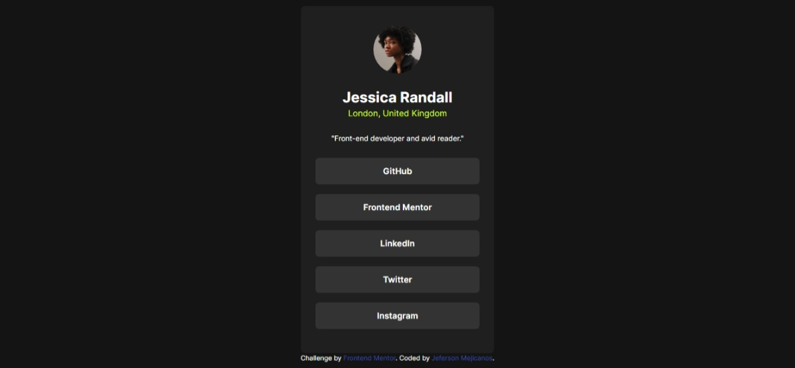

# Frontend Mentor - Social links profile solution

This is a solution to the [Social links profile challenge on Frontend Mentor](https://www.frontendmentor.io/challenges/social-links-profile-UG32l9m6dQ). Frontend Mentor challenges help you improve your coding skills by building realistic projects. 

## Table of contents

- [Overview](#overview)
  - [The challenge](#the-challenge)
  - [Screenshot](#screenshot)
  - [Links](#links)
- [My process](#my-process)
  - [Built with](#built-with)
  - [What I learned](#what-i-learned)
  - [Continued development](#continued-development)
- [Author](#author)
## Overview

### The challenge

Users should be able to:

- See hover and focus states for all interactive elements on the page

### Screenshot



### Links

- Solution URL: [Repo](https://github.com/Jeferson57/reto-1-social-link-profile-main)
- Live Site URL: [Live Solution](https://jeferson57.github.io/reto-1-social-link-profile-main/)

## My process

### Built with

- Semantic HTML5 markup
- Tailwind
- Flexbox
- CSS Grid
- Mobile-first workflow

### What I learned

Custom colors in Tailwind
```js
module.exports = {
  theme: {
    colors: {
      "Green": "hsl(75, 94%, 57%)",
      "White": "hsl(0, 0%, 100%)",
      "Grey": "hsl(0, 0%, 20%)",
      "Dark-Grey": "hsl(0, 0%, 12%)",
      "Off-Black": "hsl(0, 0%, 8%)"
    },
  },
}
```

Styles class
```html
<h2 class="text-White text-2xl font-bold">
  Jessica Randall
</h2>
```


### Continued development

I would like learn more about JavaScript and focusing make interactive websites and thes learn Reat.js. But a lear some tricks with Tailwind like animation, dark mode, state...

**Note: Delete this note and the content within this section and replace with your own plans for continued development.**


## Author

- Frontend Mentor - [@Jeferson57](https://www.frontendmentor.io/profile/Jeferson57)
- Twitter - [@Jeferso06531446](https://twitter.com/Jeferso06531446)